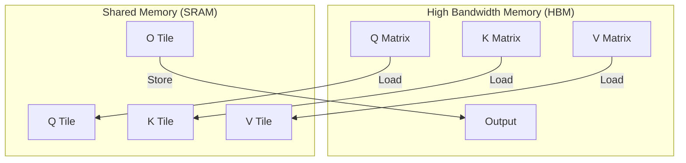

# FlashAttention Deep Dive

A comprehensive technical analysis of the FlashAttention algorithm implementation in LLM-Speed.

## Algorithm Overview

FlashAttention is an **IO-aware** exact attention algorithm that reduces memory complexity from $O(N^2)$ to $O(N)$ while maintaining numerical equivalence to standard attention.

### Standard Attention

The standard attention computation:

$$\text{Attention}(Q, K, V) = \text{softmax}\left(\frac{QK^T}{\sqrt{d_k}}\right)V$$

Requires materializing the full $N \times N$ attention matrix, consuming $O(N^2)$ memory.

### FlashAttention Approach

FlashAttention avoids materializing the attention matrix by:

1. **Tiling**: Processing attention in blocks that fit in SRAM
2. **Online Softmax**: Computing softmax incrementally without storing all values
3. **Recomputation**: Recalculating attention weights during backward pass

<RoadmapTimeline />

## Implementation Details

### Online Softmax Algorithm

The key insight is that softmax can be computed incrementally using the **online softmax** trick:

```cuda
struct OnlineSoftmaxState {
    float max_val;      // Running maximum
    float sum_exp;      // Running sum of exp(x - max)
    float output;       // Accumulated output
};
```

When merging two tiles:

<AlgorithmCard
  title="Online Softmax Merge"
  description="Merge two partial softmax states into one"
  timeComplexity="O(1)"
  spaceComplexity="O(1)"
  :code="`// Merge new tile into existing state\nfloat new_max = max(old.max_val, new.max_val);\nfloat rescale_old = exp(old.max_val - new_max);\nfloat rescale_new = exp(new.max_val - new_max);\n\nfloat new_sum = old.sum_exp * rescale_old + new.sum_exp * rescale_new;\nfloat new_out = old.output * rescale_old + new.output * rescale_new;\n\nstate.max_val = new_max;\nstate.sum_exp = new_sum;\nstate.output = new_out;`"
/>

### Memory Hierarchy Utilization



### Tiling Strategy

The kernel processes attention in tiles:

| Tile Size | Shared Memory | Purpose |
|-----------|---------------|---------|
| $B_r \times d$ | $B_r \times d \times 2$ bytes | Query tile |
| $B_c \times d$ | $B_c \times d \times 2$ bytes | Key tile |
| $B_c \times d$ | $B_c \times d \times 2$ bytes | Value tile |
| $B_r \times B_c$ | $B_r \times B_c \times 4$ bytes | Attention scores |

For A100 (192KB shared memory), typical tile sizes:
- $B_r = 128$ (query block size)
- $B_c = 128$ (key/value block size)
- $d = 64$ (head dimension)

## Double Buffering

To overlap compute and memory access:

<CodeDiff
  leftLabel="Without Double Buffer"
  rightLabel="With Double Buffer"
  :leftCode="`// Sequential load-compute\nload_tile(Q, q_tile);\nload_tile(K, k_tile);\nload_tile(V, v_tile);\nsync();\ncompute_attention(q_tile, k_tile, v_tile);\nsync();\nstore_output(output);`"
  :rightCode="`// Overlapped load-compute\nload_tile_async(Q, q_tile_next);\ncompute_attention(q_tile_curr, k_tile, v_tile);\nsync();\nswap(q_tile_curr, q_tile_next);\n// Next iteration load overlaps compute`"
/>

## Causal Masking

For autoregressive models, we apply causal masking:

$$S_{ij} = \begin{cases} Q_i K_j^T / \sqrt{d} & \text{if } j \leq i \\ -\infty & \text{otherwise} \end{cases}$$

Implementation:

```cuda
// Apply causal mask within tile
if (i + row_idx > j + col_idx) {
    scores[row][col] = -INFINITY;  // Mask future positions
}
```

## Performance Characteristics

### Memory Complexity

| Implementation | Memory | 1K Sequence | 4K Sequence | 16K Sequence |
|----------------|--------|-------------|-------------|--------------|
| Standard | $O(N^2)$ | 4 MB | 64 MB | 1 GB |
| FlashAttention | $O(N)$ | 0.25 MB | 1 MB | 4 MB |

### Arithmetic Intensity

$$\text{Arithmetic Intensity} = \frac{\text{FLOPs}}{\text{Bytes Transferred}}$$

For FlashAttention:
- FLOPs: $4N^2d$ (QK, softmax, AV)
- HBM Access: $O(Nd)$ (streaming Q, K, V)
- Intensity: $O(N)$ — increases with sequence length!

This means FlashAttention becomes **more efficient** for longer sequences.

## References

1. [FlashAttention: Fast and Memory-Efficient Exact Attention](https://arxiv.org/abs/2205.14135)
2. [FlashAttention-2: Faster Attention with Better Parallelism and Work Partitioning](https://arxiv.org/abs/2307.0869)

---

[← Architecture Overview](/en/architecture/) | [API Reference →](/en/api/)
