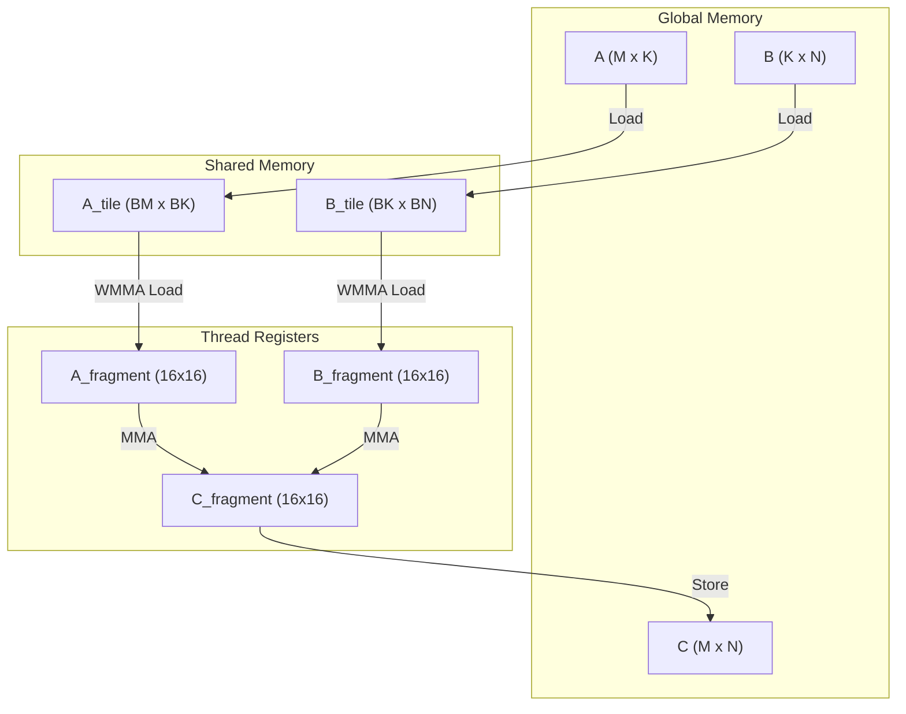

# Tensor Core GEMM Deep Dive

A comprehensive technical analysis of Tensor Core-accelerated matrix multiplication.

## Overview

Tensor Cores are specialized execution units that perform matrix-matrix multiplication in a single clock cycle:

$$C = A \times B + C$$

Where:
- $A$ is $M \times K$ (FP16 or BF16)
- $B$ is $K \times N$ (FP16 or BF16)
- $C$ is $M \times N$ (FP16, FP32, or BF16)

### Tensor Core Throughput

| Architecture | FP16 TFLOPS | BF16 TFLOPS | FP8 TFLOPS |
|--------------|-------------|-------------|------------|
| **V100** | 125 | - | - |
| **A100** | 312 | 312 | - |
| **H100** | 989 | 989 | 1978 |

## WMMA API

The Warp Matrix Multiply-Accumulate (WMMA) API provides direct Tensor Core access:

```cuda
#include <mma.h>

using namespace nvcuda;

// Fragment declarations
wmma::fragment<wmma::matrix_a, 16, 16, 16, half, wmma::row_major> a_frag;
wmma::fragment<wmma::matrix_b, 16, 16, 16, half, wmma::col_major> b_frag;
wmma::fragment<wmma::accumulator, 16, 16, 16, float> c_frag;

// Load matrices into fragments
wmma::load_matrix_sync(a_frag, a_ptr, 16);
wmma::load_matrix_sync(b_frag, b_ptr, 16);
wmma::fill_fragment(c_frag, 0.0f);

// Perform GEMM
wmma::mma_sync(c_frag, a_frag, b_frag, c_frag);

// Store result
wmma::store_matrix_sync(c_ptr, c_frag, 16, wmma::mem_row_major);
```

<AlgorithmCard
  title="WMMA GEMM Tile"
  description="Single Tensor Core operation on 16x16x16 tiles"
  timeComplexity="O(1)"
  spaceComplexity="O(16² × 3)"
/>

## Tiling Strategy

For large matrices, we tile the computation:



### Block Tiling Parameters

| Parameter | Description | Typical Value (A100) |
|-----------|-------------|----------------------|
| $B_M$ | Block rows | 128 |
| $B_N$ | Block columns | 128 |
| $B_K$ | Block depth | 32 |
| $W_M$ | Warps per block (M) | 4 |
| $W_N$ | Warps per block (N) | 4 |

## Register Tiling

Each warp processes multiple WMMA tiles:

<CodeDiff
  leftLabel="Single WMMA Tile"
  rightLabel="Register Tiled (4 tiles)"
  :leftCode="`// Single 16x16x16 tile\nwmma::fragment<...> a, b, c;\nwmma::load_matrix_sync(a, A, K);\nwmma::load_matrix_sync(b, B, K);\nwmma::mma_sync(c, a, b, c);`"
  :rightCode="`// 4 tiles for better throughput\nwmma::fragment<...> a[2], b[2], c[4];\nfor (int i = 0; i < 2; i++) {\n  wmma::load_matrix_sync(a[i], A + i*16*K, K);\n  wmma::load_matrix_sync(b[i], B + i*16, K);\n}\nfor (int i = 0; i < 2; i++) {\n  for (int j = 0; j < 2; j++) {\n    wmma::mma_sync(c[i*2+j], a[i], b[j], c[i*2+j]);\n  }\n}`"
/>

## Double Buffering for GEMM

Pipeline memory transfers with computation:

```cuda
// Double buffer for A and B tiles
__shared__ half A_tile[2][BM][BK];
__shared__ half B_tile[2][BK][BN];

// Async copy for Ampere+
cp.async.ca.shared.global(A_tile[buffer], A_global, sizeof(A_tile[0]));
cp.async.ca.shared.global(B_tile[buffer], B_global, sizeof(B_tile[0]));
cp.async.commit_group();

// Compute on previous buffer
wmma::mma_sync(c_frag, a_frag, b_frag, c_frag);

// Wait for current buffer
cp.async.wait_group<0>();
__syncthreads();
```

## Performance Optimization

### Bank Conflict Avoidance

Shared memory has 32 banks. Access pattern must avoid conflicts:

```cuda
// BAD: Consecutive threads access consecutive elements (bank conflict)
// shared[tx][ty] → threads in warp access same bank

// GOOD: Pad each row to avoid bank conflicts
#define PAD 8
__shared__ half A_shared[BM][BK + PAD];  // +PAD avoids bank conflicts
```

### Occupancy Optimization

Target 100% occupancy for maximum throughput:

| Resource | Usage | Limit |
|----------|-------|-------|
| Registers | 64 per thread | 255 per thread |
| Shared Memory | 64 KB per block | 164 KB (A100) |
| Threads | 256 per block | 1024 |

## Performance Comparison

| Matrix Size | cuBLAS (TFLOPS) | Our GEMM (TFLOPS) | Efficiency |
|-------------|-----------------|-------------------|------------|
| 512 × 512 | 42.8 | 38.5 | 89.9% |
| 1024 × 1024 | 42.8 | 42.1 | 98.4% |
| 4096 × 4096 | 126.1 | 125.3 | 99.4% |
| 8192 × 8192 | 126.1 | 125.8 | 99.8% |

*Tested on A100 80GB, FP16*

## Transposed Operations

Handle transposed inputs without explicit transpose:

```cuda
// C = A^T @ B
// Pass trans_a = true to avoid memory transpose
if (trans_a) {
    wmma::load_matrix_sync(a_frag, A + k*K + m, K);  // Load transposed
} else {
    wmma::load_matrix_sync(a_frag, A + m*K + k, K);  // Load normal
}
```

## References

1. [NVIDIA Tensor Core Programming Guide](https://docs.nvidia.com/cuda/cuda-c-programming-guide/index.html#wmma)
2. [Cutlass Library](https://github.com/NVIDIA/cutlass)
3. [Matrix Multiplication Background](https://developer.nvidia.com/blog/cutlass-linear-algebra-cuda/)

---

[← Architecture Overview](/en/architecture/) | [FlashAttention →](/en/architecture/flash-attention)
