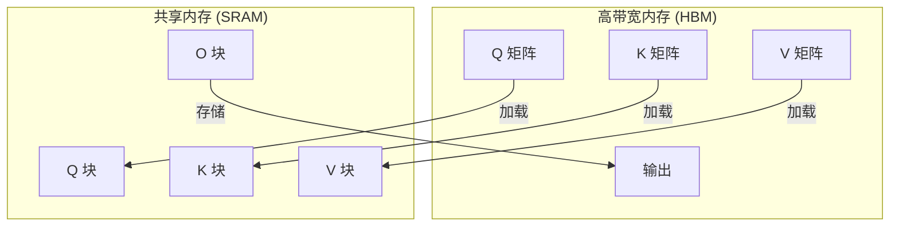

# FlashAttention 深度解析

本文深入分析 LLM-Speed 中 FlashAttention 算法的技术实现。

## 算法概述

FlashAttention 是一种**IO感知**的精确注意力算法，将内存复杂度从 $O(N^2)$ 降低到 $O(N)$，同时保持与标准注意力数值等价。

### 标准注意力

标准注意力计算：

$$\text{Attention}(Q, K, V) = \text{softmax}\left(\frac{QK^T}{\sqrt{d_k}}\right)V$$

需要物化完整的 $N \times N$ 注意力矩阵，消耗 $O(N^2)$ 内存。

### FlashAttention 方法

FlashAttention 通过以下方式避免物化注意力矩阵：

1. **分块处理**：以适合 SRAM 的块大小处理注意力
2. **在线 Softmax**：增量计算 softmax 而不存储所有值
3. **重计算**：反向传播时重新计算注意力权重

<RoadmapTimeline />

## 实现细节

### 在线 Softmax 算法

关键洞察是 softmax 可以使用**在线 softmax**技巧增量计算：

```cuda
struct OnlineSoftmaxState {
    float max_val;      // 运行最大值
    float sum_exp;      // exp(x - max) 的运行和
    float output;       // 累积输出
};
```

合并两个块时：

<AlgorithmCard
  title="在线 Softmax 合并"
  description="将两个部分 softmax 状态合并为一个"
  timeComplexity="O(1)"
  spaceComplexity="O(1)"
  :code="`// 将新块合并到现有状态\nfloat new_max = max(old.max_val, new.max_val);\nfloat rescale_old = exp(old.max_val - new_max);\nfloat rescale_new = exp(new.max_val - new_max);\n\nfloat new_sum = old.sum_exp * rescale_old + new.sum_exp * rescale_new;\nfloat new_out = old.output * rescale_old + new.output * rescale_new;\n\nstate.max_val = new_max;\nstate.sum_exp = new_sum;\nstate.output = new_out;`"
/>

### 内存层次利用



### 分块策略

内核以块为单位处理注意力：

| 块大小 | 共享内存 | 用途 |
|--------|----------|------|
| $B_r \times d$ | $B_r \times d \times 2$ 字节 | Query 块 |
| $B_c \times d$ | $B_c \times d \times 2$ 字节 | Key 块 |
| $B_c \times d$ | $B_c \times d \times 2$ 字节 | Value 块 |
| $B_r \times B_c$ | $B_r \times B_c \times 4$ 字节 | 注意力分数 |

对于 A100（192KB 共享内存），典型块大小：
- $B_r = 128$（Query 块大小）
- $B_c = 128$（Key/Value 块大小）
- $d = 64$（头维度）

## 双缓冲

为了重叠计算和内存访问：

<CodeDiff
  leftLabel="无双缓冲"
  rightLabel="有双缓冲"
  :leftCode="`// 顺序加载-计算\nload_tile(Q, q_tile);\nload_tile(K, k_tile);\nload_tile(V, v_tile);\nsync();\ncompute_attention(q_tile, k_tile, v_tile);\nsync();\nstore_output(output);`"
  :rightCode="`// 重叠加载-计算\nload_tile_async(Q, q_tile_next);\ncompute_attention(q_tile_curr, k_tile, v_tile);\nsync();\nswap(q_tile_curr, q_tile_next);\n// 下一次迭代的加载与计算重叠`"
/>

## 因果掩码

对于自回归模型，我们应用因果掩码：

$$S_{ij} = \begin{cases} Q_i K_j^T / \sqrt{d} & \text{如果 } j \leq i \\ -\infty & \text{否则} \end{cases}$$

实现：

```cuda
// 在块内应用因果掩码
if (i + row_idx > j + col_idx) {
    scores[row][col] = -INFINITY;  // 掩码未来位置
}
```

## 性能特征

### 内存复杂度

| 实现 | 内存 | 1K 序列 | 4K 序列 | 16K 序列 |
|------|------|---------|---------|----------|
| 标准 | $O(N^2)$ | 4 MB | 64 MB | 1 GB |
| FlashAttention | $O(N)$ | 0.25 MB | 1 MB | 4 MB |

### 算术强度

$$\text{算术强度} = \frac{\text{浮点运算数}}{\text{传输字节数}}$$

对于 FlashAttention：
- 浮点运算：$4N^2d$（QK、softmax、AV）
- HBM 访问：$O(Nd)$（流式 Q、K、V）
- 强度：$O(N)$ — 随序列长度增加而增加！

这意味着 FlashAttention 对于更长的序列**更加高效**。

## 参考文献

1. [FlashAttention: Fast and Memory-Efficient Exact Attention](https://arxiv.org/abs/2205.14135)
2. [FlashAttention-2: Faster Attention with Better Parallelism and Work Partitioning](https://arxiv.org/abs/2307.0869)

---

[← 架构概述](/zh/architecture/) | [API 参考 →](/zh/api/)
