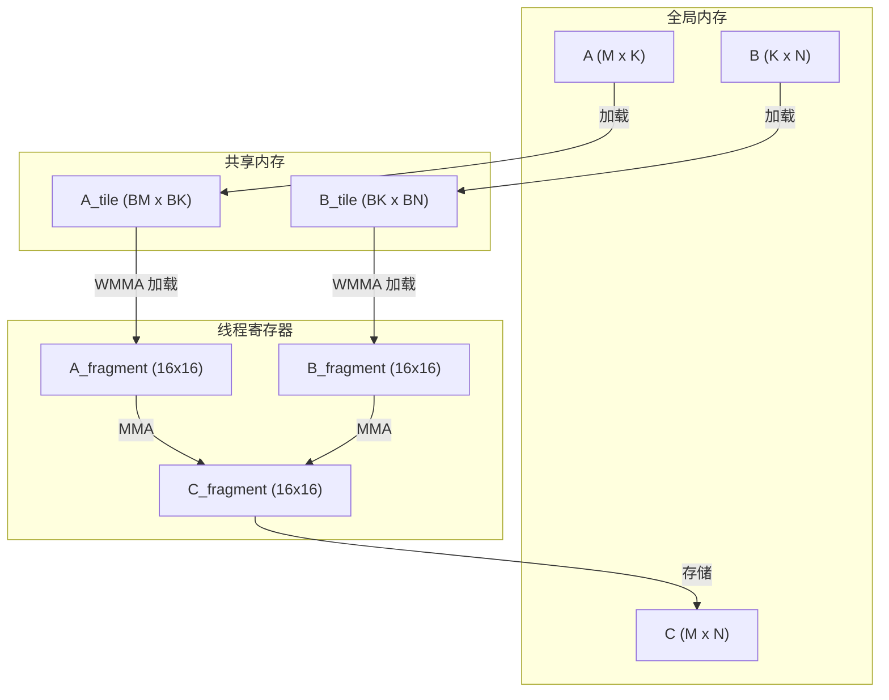

# Tensor Core GEMM 深度解析

全面分析 Tensor Core 加速矩阵乘法的技术实现。

## 概述

Tensor Core 是专用执行单元，在单个时钟周期内执行矩阵-矩阵乘法：

$$C = A \times B + C$$

其中：
- $A$ 为 $M \times K$（FP16 或 BF16）
- $B$ 为 $K \times N$（FP16 或 BF16）
- $C$ 为 $M \times N$（FP16、FP32 或 BF16）

### Tensor Core 吞吐量

| 架构 | FP16 TFLOPS | BF16 TFLOPS | FP8 TFLOPS |
|------|-------------|-------------|------------|
| **V100** | 125 | - | - |
| **A100** | 312 | 312 | - |
| **H100** | 989 | 989 | 1978 |

## WMMA API

Warp Matrix Multiply-Accumulate (WMMA) API 提供直接的 Tensor Core 访问：

```cuda
#include <mma.h>

using namespace nvcuda;

// 片段声明
wmma::fragment<wmma::matrix_a, 16, 16, 16, half, wmma::row_major> a_frag;
wmma::fragment<wmma::matrix_b, 16, 16, 16, half, wmma::col_major> b_frag;
wmma::fragment<wmma::accumulator, 16, 16, 16, float> c_frag;

// 将矩阵加载到片段中
wmma::load_matrix_sync(a_frag, a_ptr, 16);
wmma::load_matrix_sync(b_frag, b_ptr, 16);
wmma::fill_fragment(c_frag, 0.0f);

// 执行 GEMM
wmma::mma_sync(c_frag, a_frag, b_frag, c_frag);

// 存储结果
wmma::store_matrix_sync(c_ptr, c_frag, 16, wmma::mem_row_major);
```

<AlgorithmCard
  title="WMMA GEMM 块"
  description="在 16x16x16 块上执行单个 Tensor Core 操作"
  timeComplexity="O(1)"
  spaceComplexity="O(16² × 3)"
/>

## 分块策略

对于大矩阵，我们将计算分块：



### 块分块参数

| 参数 | 描述 | 典型值 (A100) |
|------|------|---------------|
| $B_M$ | 块行数 | 128 |
| $B_N$ | 块列数 | 128 |
| $B_K$ | 块深度 | 32 |
| $W_M$ | 每块 Warp 数 (M) | 4 |
| $W_N$ | 每块 Warp 数 (N) | 4 |

## 寄存器分块

每个 Warp 处理多个 WMMA 块：

<CodeDiff
  leftLabel="单个 WMMA 块"
  rightLabel="寄存器分块 (4 块)"
  :leftCode="`// 单个 16x16x16 块\nwmma::fragment<...> a, b, c;\nwmma::load_matrix_sync(a, A, K);\nwmma::load_matrix_sync(b, B, K);\nwmma::mma_sync(c, a, b, c);`"
  :rightCode="`// 4 块以获得更好吞吐量\nwmma::fragment<...> a[2], b[2], c[4];\nfor (int i = 0; i < 2; i++) {\n  wmma::load_matrix_sync(a[i], A + i*16*K, K);\n  wmma::load_matrix_sync(b[i], B + i*16, K);\n}\nfor (int i = 0; i < 2; i++) {\n  for (int j = 0; j < 2; j++) {\n    wmma::mma_sync(c[i*2+j], a[i], b[j], c[i*2+j]);\n  }\n}`"
/>

## GEMM 双缓冲

流水线化内存传输与计算：

```cuda
// A 和 B 块的双缓冲
__shared__ half A_tile[2][BM][BK];
__shared__ half B_tile[2][BK][BN];

// Ampere+ 异步拷贝
cp.async.ca.shared.global(A_tile[buffer], A_global, sizeof(A_tile[0]));
cp.async.ca.shared.global(B_tile[buffer], B_global, sizeof(B_tile[0]));
cp.async.commit_group();

// 在前一个缓冲区上计算
wmma::mma_sync(c_frag, a_frag, b_frag, c_frag);

// 等待当前缓冲区
cp.async.wait_group<0>();
__syncthreads();
```

## 性能优化

### Bank 冲突避免

共享内存有 32 个 bank。访问模式必须避免冲突：

```cuda
// 错误：连续线程访问连续元素（bank 冲突）
// shared[tx][ty] → warp 中的线程访问同一个 bank

// 正确：填充每行以避免 bank 冲突
#define PAD 8
__shared__ half A_shared[BM][BK + PAD];  // +PAD 避免 bank 冲突
```

### 占用率优化

目标 100% 占用率以获得最大吞吐量：

| 资源 | 使用量 | 限制 |
|------|--------|------|
| 寄存器 | 每线程 64 | 每线程 255 |
| 共享内存 | 每块 64 KB | 164 KB (A100) |
| 线程 | 每块 256 | 1024 |

## 性能对比

| 矩阵大小 | cuBLAS (TFLOPS) | 我们的 GEMM (TFLOPS) | 效率 |
|----------|-----------------|---------------------|------|
| 512 × 512 | 42.8 | 38.5 | 89.9% |
| 1024 × 1024 | 42.8 | 42.1 | 98.4% |
| 4096 × 4096 | 126.1 | 125.3 | 99.4% |
| 8192 × 8192 | 126.1 | 125.8 | 99.8% |

*在 A100 80GB 上测试，FP16*

## 转置操作

无需显式转置即可处理转置输入：

```cuda
// C = A^T @ B
// 传递 trans_a = true 以避免内存转置
if (trans_a) {
    wmma::load_matrix_sync(a_frag, A + k*K + m, K);  // 加载转置
} else {
    wmma::load_matrix_sync(a_frag, A + m*K + k, K);  // 正常加载
}
```

## 参考文献

1. [NVIDIA Tensor Core 编程指南](https://docs.nvidia.com/cuda/cuda-c-programming-guide/index.html#wmma)
2. [Cutlass 库](https://github.com/NVIDIA/cutlass)
3. [矩阵乘法背景](https://developer.nvidia.com/blog/cutlass-linear-algebra-cuda/)

---

[← 架构概述](/zh/architecture/) | [FlashAttention →](/zh/architecture/flash-attention)
